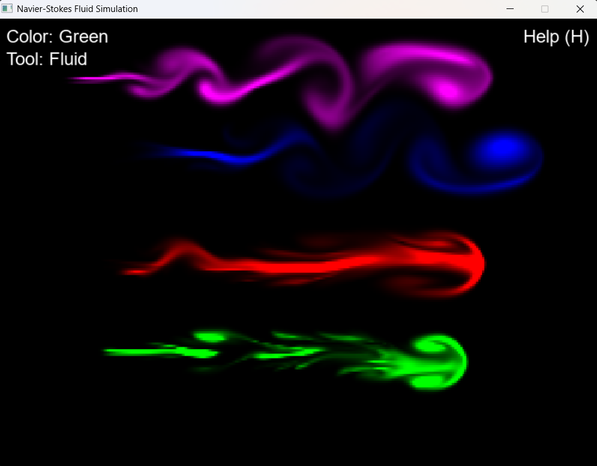

<!-- Improved compatibility of back to top link: See: https://github.com/othneildrew/Best-README-Template/pull/73 -->

 

  

  <h3 align="center">Navier Stokes</h3>

  

    A simple C++ / SDL2 implementation of the Navier-Stokes fluid simulation algorithm
     
  

<!-- ABOUT THE PROJECT -->
## About The Project

This is a simple implementation of the Navier-Stokes fluid simulation algorithm, built using C++ and SDL2.

#### Features
- Color changing (Right mouse click)
- Diffferent fluid disturbance tools (Fluid & Explosion) (Tool: T)
- Simulation clearing (Clear: C)
- Help screen (Help: H)

### Upcoming features
- Fluid emitters
- Fluid collectors
- Barrier drawing

(<a href="#readme-top">back to top</a>)

### Built With

- C++
- CMake
- SDL2

(<a href="#readme-top">back to top</a>)

<!-- GETTING STARTED -->
## Getting Started

TODO